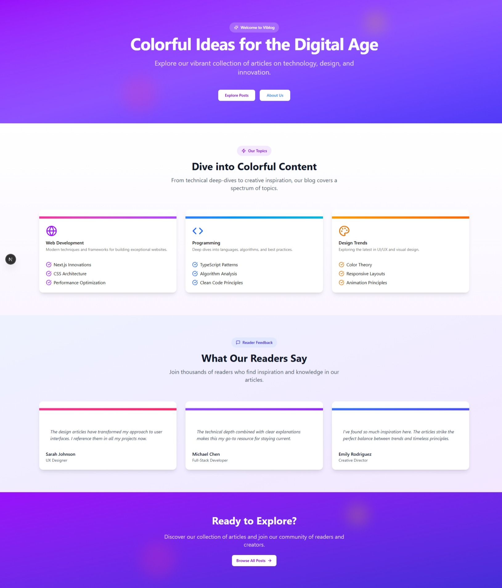
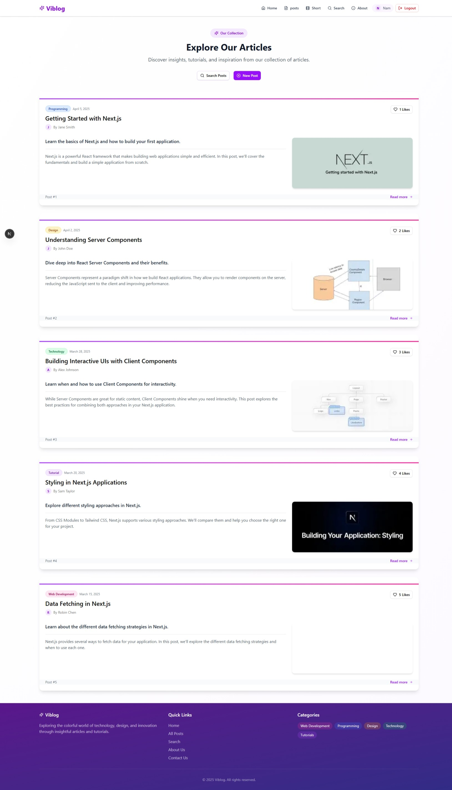
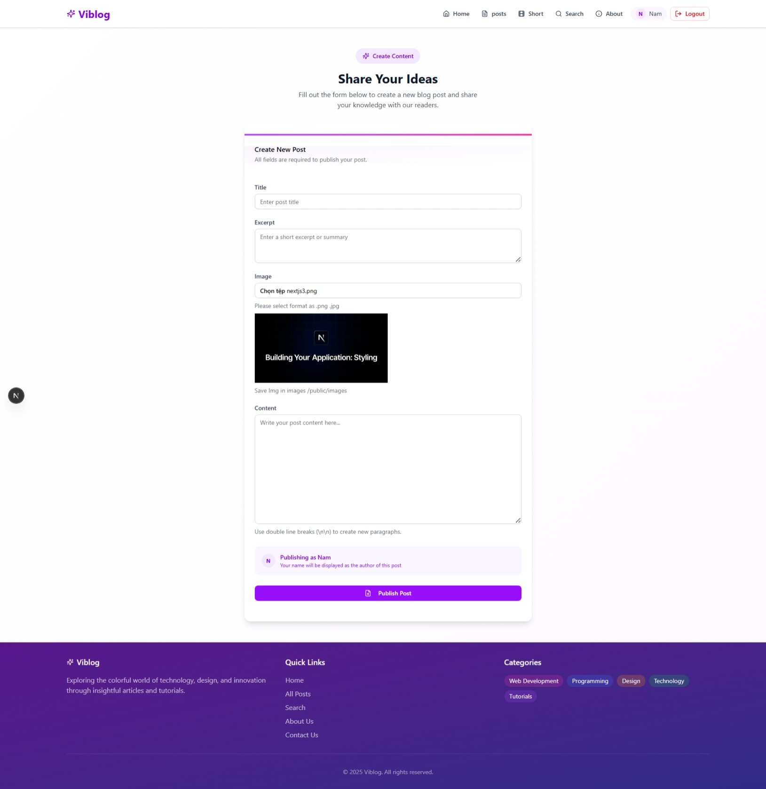
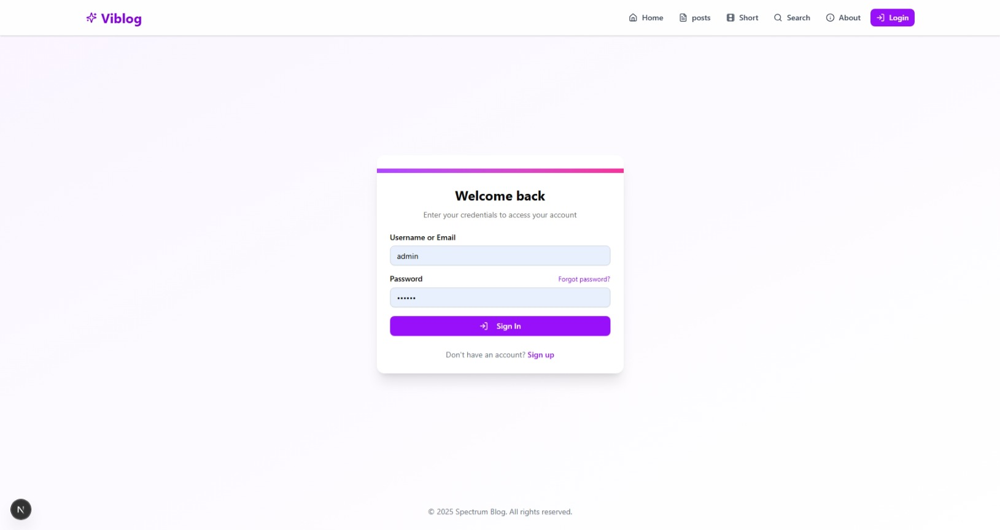
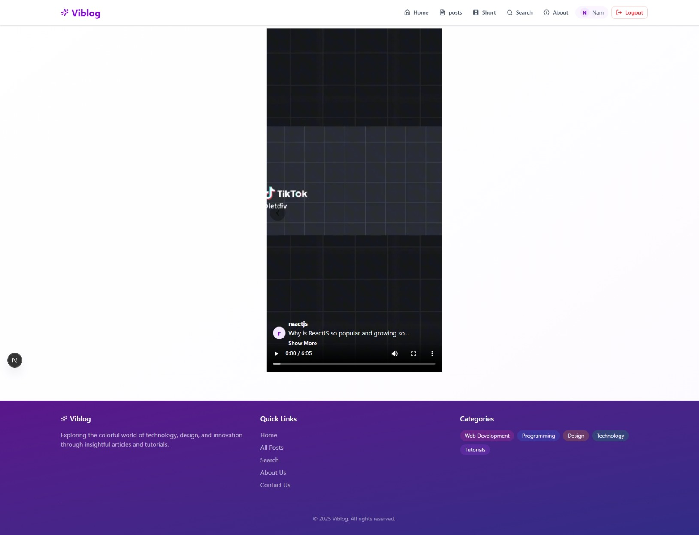

# Viblog - Modern Blog Platform

A modern, feature-rich blog platform built with Next.js 14, TypeScript, and Tailwind CSS.

## 📸 Screenshots

### Homepage

*Clean and modern homepage design*

### Blog Posts

*Blog listing with rich content support*

### Create Post

*Intuitive post creation interface*

### Authentication

*Secure and user-friendly login interface*

### Video Feature

*Short video feature demonstration*

## Features

### 🔐 Authentication & Authorization
- Secure user authentication system
- Protected routes and API endpoints
- Persistent login with AuthContext
- User role management

### 📝 Blog Management
- Create, edit, and delete blog posts
- Rich text editor support
- Image upload functionality
- Post categorization and tagging

### 🎥 Video Content
- Short video feature similar to YouTube Shorts
- Video upload and management
- Custom video player interface
- Video thumbnails generation

### 💬 Contact System
- Contact form for user inquiries
- Email notification system
- Message management interface

### 🎨 Modern UI/UX
- Responsive design with Tailwind CSS
- Clean and intuitive interface
- Toast notifications with Sonner
- Loading states and animations
- Dark/Light theme support

## Tech Stack

- **Framework**: Next.js 14 (App Router)
- **Language**: TypeScript
- **Styling**: Tailwind CSS
- **UI Components**: shadcn/ui
- **State Management**: React Context
- **Authentication**: Custom JWT implementation
- **Database**: Your choice of database
- **Notifications**: Sonner toast
- **Deployment**: Vercel (recommended)

## Getting Started

### Prerequisites

- Node.js 18+ 
- npm or yarn
- Git

### Installation

1. Clone the repository:
```bash
git clone https://github.com/yourusername/viblog.git
cd viblog
```

2. Install dependencies:
```bash
npm install
# or
yarn install
```

3. Set up environment variables:
```bash
cp .env.example .env.local
```
Edit `.env.local` with your configuration.

4. Run the development server:
```bash
npm run dev
# or
yarn dev
```

5. Open [http://localhost:3000](http://localhost:3000) in your browser.

## Project Structure

```
viblog/
├── src/
│   ├── app/                 # App router pages
│   ├── components/          # Reusable components
│   ├── contexts/           # React contexts (Auth, etc.)
│   ├── types/              # TypeScript interfaces
│   └── lib/                # Utility functions
├── public/                 # Static assets
└── ...config files
```

## Key Features Implementation

### Authentication
- Uses JWT for secure authentication
- AuthContext for global auth state management
- Protected API routes and client-side guards

### Toast Notifications
- Implemented using Sonner
- Rich colors for different states
- Customizable position and duration
- Consistent styling across the app

### Responsive Design
- Mobile-first approach
- Tailwind CSS for styling
- Fluid typography and spacing
- Optimized for all screen sizes

## Contributing

1. Fork the repository
2. Create your feature branch (`git checkout -b feature/AmazingFeature`)
3. Commit your changes (`git commit -m 'Add some AmazingFeature'`)
4. Push to the branch (`git push origin feature/AmazingFeature`)
5. Open a Pull Request

## License

This project is licensed under the MIT License - see the LICENSE file for details.

## Acknowledgments

- [Next.js](https://nextjs.org/)
- [Tailwind CSS](https://tailwindcss.com/)
- [shadcn/ui](https://ui.shadcn.com/)
- [Sonner](https://sonner.emilkowal.ski/)

## Contact & Support

- **GitHub**: [HuuNam3](https://github.com/HuuNam3)
- **Email**: nhnam4411@gmail.com
- **Repository**: [https://github.com/HuuNam3/Viblog](https://github.com/HuuNam3/Viblog)

Feel free to reach out if you have any questions or suggestions!

---

Made with ❤️ by [Huu Nam]